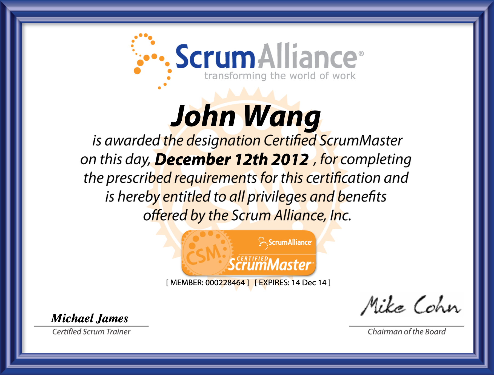

# The Value of Renewing Scrum Alliance Certifications (CSM and CSPO)

## TL;DR

Renewing my Scrum Alliance Certified ScrumMaster (CSM) and Certified Scrum Product Owner (CSPO) certifications exceeded my expectations and provided valuable benefits. This article outlines the additional knowledge and insights gained during the renewal process and emphasizes the significance of staying up-to-date with Scrum certifications.

## Introduction

Renewing my Scrum Alliance certifications for Certified ScrumMaster (CSM) and Certified Scrum Product Owner (CSPO) turned out to be a more rewarding experience than I had anticipated. In this article, I will share the valuable insights and learnings I acquired during the renewal process, emphasizing the importance of staying connected with Scrum Alliance and its resources.

This is what my certificate looked like when I received it in 2012:

And this is what it looked like in 2023 with the inactive notice. Of note, the design changed, but so much time had passed that an intermediate design had come and gone as well.

## The Decision

After over a decade since initially obtaining my CSM and CSPO certifications, I decided it was time to renew them. Despite working in various agile organizations during the intervening years, I hadn't felt the need to update my certifications. However, circumstances changed when I found myself in an organization undergoing an agile transformation, prompting me to advance my agile journey with Scrum Alliance.

My goal was to progress through the Advanced levels and beyond, which required me to update my certificates through education and a fee. Initially, I viewed this as a mere prerequisite for accessing the Advanced level programs. However, I soon realized that the journey itself held immense value, and I found great benefit in acquiring the required education, as detailed below.

## The Requirements

Renewing my certifications initially seemed daunting due to the substantial amount of time that had passed and the requirement of 40 Scrum Education Units (SEUs) for both my CSM and CSPO certifications (20 each). However, it turned out that I only needed 30 SEUs in total, thanks to a 10 SEU discount for renewing both certifications simultaneously.

To meet the SEU requirement, I explored various avenues, including:

1. Reading articles.
1. Watching videos.
1. Attending conferences and meetups.
1. Engaging in volunteer work.

While volunteer Scrum work was the most SEU-rich option, it proved to be scarce and required some lead time. Similarly, attending conferences and meetups took time. Consequently, I began by watching videos and reading articles. Initially, I manually inputted these activities into the Scrum Alliance website, but later discovered the convenience of automatic SEU tracking.

## The Content

Throughout the renewal process, I delved into numerous articles and watched several videos. These resources expanded my understanding and appreciation of Scrum and Agile methodologies. Some of the articles were so informative that I saved them for future reference. Here are a few noteworthy articles:

1. [Get in FRONT of the Daily Scrum](https://resources.scrumalliance.org/Article/daily-scrum) by [Bonsy Yelsangi](https://www.scrumalliance.org/community/profile/byelsangi)
1. [7 Traits of a Good Facilitator](https://resources.scrumalliance.org/Article/7-traits-good-facilitator) by [Scrum Alliance](https://www.scrumalliance.org/about-us)
1. [The Differences Between Project Managers and Scrum Masters](https://resources.scrumalliance.org/Article/difference-project-managers-scrum-masters) by [Natalie Barnes](https://www.scrumalliance.org/community/profile/nbarnes2)
1. [The Anatomy of a User Story](https://resources.scrumalliance.org/Article/anatomy-user-story) by [Jim Schiel](https://www.scrumalliance.org/community/profile/jschiel)
1. [How to Stop Facilitating the World's Most Boring Meetings](https://resources.scrumalliance.org/Article/stop-facilitating-worlds-boring-meetings) by [Vibhu Srinivasan](https://www.scrumalliance.org/community/profile/vsrinivasa)
1. [How Much Detail Should Be In My Product Roadmap?](https://resources.scrumalliance.org/Article/product-roadmap)
1. [Sample Sprint Review Agenda & Tips from a Coach](https://resources.scrumalliance.org/Article/sample-sprint-review-agenda-tips-coach) by [Joel Bancroft-Connors](https://www.scrumalliance.org/community/profile/jbancroftc)
1. [How to Become a Catalyst Leader](https://resources.scrumalliance.org/Article/catalyst-leader)
1. [3 Traits Great Agile Leaders Display (Plus 1 Factor That Doesn’t Matter at All)](https://resources.scrumalliance.org/Article/3-traits-great-agile-leaders-display-(plus-1-factor-doesn%E2%80%99t-matter-all))
1. [Great Scrum Masters Demonstrate 5 Key Values](https://resources.scrumalliance.org/Article/great-scrum-masters-demonstrate-5-key-values)
1. [Measuring Progress Toward Agility](https://resources.scrumalliance.org/Article/measuring-progress-agility)

## The Renewal

The Scrum Alliance dashboard provided an informative progress meter, updated in near real-time after completing content on the website. Surprisingly, I made faster progress than expected, earning 0.25 SEU per article. By the time I completed my renewal, my dashboard indicated significant progress, and I successfully updated my certification, which was now active once more.

This is what my dashboard looked liked part way through the process.

By the time I renewed, my dashboard looked like the following:

And I was able to update my cert, which showed it was active again.

## The Community

Scrum Alliance's thriving community is one of its greatest strengths. From mandatory classes to conferences and various resources, Scrum Alliance fosters a sense of belonging and collaboration. I appreciated that my certificates included the names of Certified Scrum Trainers who had instructed me: [Michael James](https://www.scrumalliance.org/community/profile/mjames) for CSM and [Chris Sims](https://www.scrumalliance.org/community/profile/csims) for CSPO.

Moreover, the renewal process allowed me to become acquainted with more members of the Scrum Alliance community through the articles they authored, some of which I mentioned earlier. Witnessing the active participation of individuals in writing articles and engaging in Scrum Alliance programs was inspiring.

## Summary

Scrum Alliance's emphasis on people, through its classes, conferences, content, and community, makes it a valuable organization. The certification renewal process, requiring Scrum Education Units (SEUs), not only enhances one's knowledge of content but also deepens their connection to the Scrum Alliance community. I eagerly look forward to continuing my learning journey with this organization and its dedicated members.